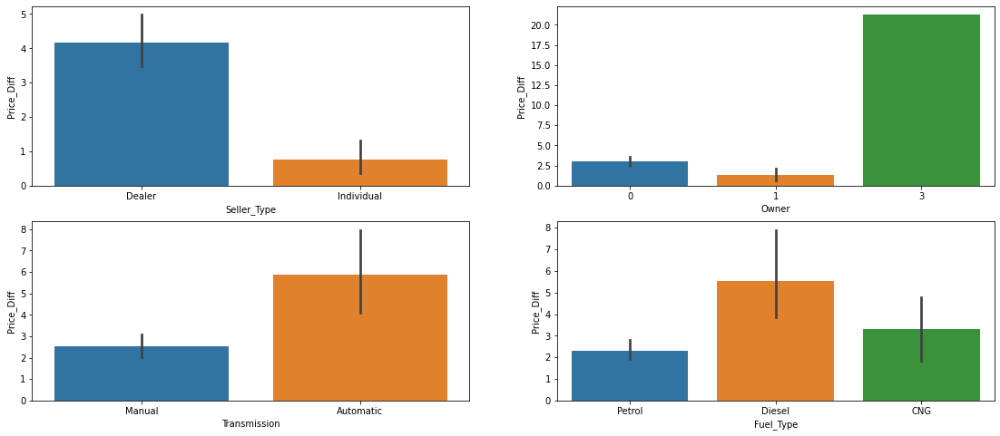
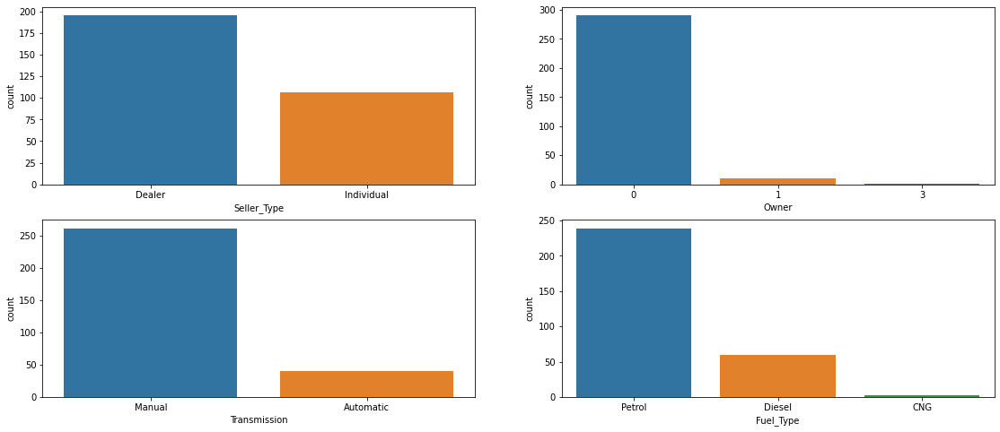
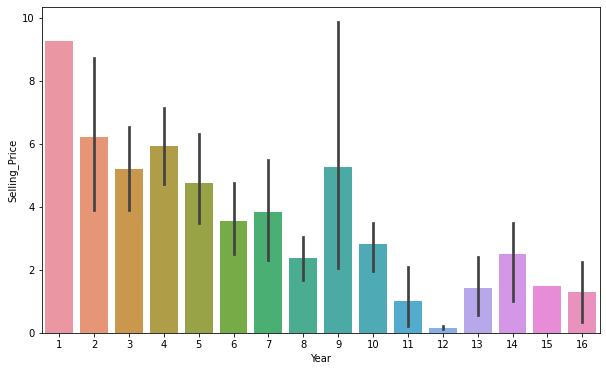
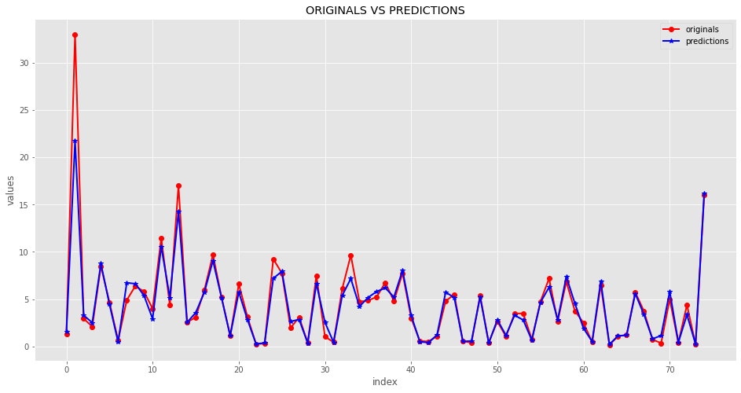

 [![Gmail][Gmail-shield]][Gmail-url]
[![LinkedIn][linkedin-shield]][linkedin-url]
[][kaggle-url]

## About The Project
After marrige you might want another car for your long drive. So, you start to wonder how much you're present car worth? Well data has the answer. From data of car's showroom price,selling price,fuel type,total driven kilometers,number of owner's car had,etc,.and help of machine learning algorhythms we can tell how much your car would make. Achived **1.1874 mse** and **0.6087 absolute error**. Data is openly availble on Kaggle and given by CarDekho.com


<!-- PROJECT LOGO -->


<!-- TABLE OF CONTENTS -->
## Table of Contents

* [About the Project](#about-the-project)
* [Brief Overview](#brief-overview)
* [How much your car worth?](#how-much-your-car-worth)
* [Deployment Dependencies](#deployment-dependencies)
* [Libraries used in Jupyter Notebook](#libraries-used-in-jupyter-notebook)


## Brief Overview
We want to predict selling price of the car, which is continuous feature. So it's a Regresson problem. Our data set has 2 intresting outliers, and is free of missing values. Created price differece feature from taking differences of Present price and Selling price, which helps to compare how much selling price depend on given specific feature.

**Category Feature and Price Difference of Present Price and Selling Price**


*Observation* Having huge difference means Selling Price is far less than Showroom Price. From diagram it's clear that fuel type Diesel,transmission automatic,and selling through Dealer are more responsible for this difference. We are not clear about owner feature, because for 3 number of owners, we have very less data.\

**Categorycal features and there counts**


**Price of car decrease as no. of years car get used**

 

**Scatter Plot of Showroom Price and Selling Price**
<div>
    <a href="https://plotly.com/~Aditya1112/13/?share_key=7SR25p2fva3nop5mp6R7sv" target="_blank" title="Plot 13" style="display: block; text-align: center;"></a>
</div>
Selling price is positively correlated with Showroom price, but there is two outliers out there, streching our whole plot, and one of the outlier is intresting to look for. Click the plot to see it's values.

```python
df[df['Kms_Driven']==500000]
```
<div>
<table border="1" class="dataframe">
  <thead>
    <tr style="text-align: right;">
      <th></th>
      <th>Car_Name</th>
      <th>Year</th>
      <th>Selling_Price</th>
      <th>Present_Price</th>
      <th>Kms_Driven</th>
      <th>Fuel_Type</th>
      <th>Seller_Type</th>
      <th>Transmission</th>
      <th>Owner</th>
      <th>Price_Diff</th>
    </tr>
  </thead>
  <tbody>
    <tr>
      <th>196</th>
      <td>Activa 3g</td>
      <td>11</td>
      <td>0.17</td>
      <td>0.52</td>
      <td>500000</td>
      <td>Petrol</td>
      <td>Individual</td>
      <td>Automatic</td>
      <td>0</td>
      <td>0.35</td>
    </tr>
  </tbody>
</table>
</div>

**Intrestingy index 196, Car name is Activa 3g (hahaha).It's a scooter not a car. It's fair to have price difference of 35k after running 500k kms for a scooter not for a car. It's a just a error made on collecting data, but we have to remove these 2 outliers to prevent error in prediction**
**Done**
<div>
    <a href="https://plotly.com/~Aditya1112/11/?share_key=gMI6KsmfoOOKifzOsvrUle" target="_blank" title="Plot 11" style="display: block; text-align: center;"></a>
</div>

**Tuning Diffrent model and predict the future with best model**
After some try and error **Random Forest** stands out
Here is prediction over actually values line diagram on testing dataset




# How much your car worth?
Now that we have model let's estimate how much your car would cut off for your new car.  Deployed these model on heroku platform, because its easy and free. Final heroku app takes car features as input and returns car selling price. 

**Note:Data set is based on cars in India, prediction very accoding to your country.** 
For deployment I've used full titanic dataset rather than only training datase to make performance much better. 
Final Heroku app takes some user inputs like Passenger Class,Age,Sex,etc,.And predict weather person will Survivr or Not using Machine Learning Model. It's completly based on previous titanic data and being predict by Random Forest algorythm's patterns. Trainnig accuracy is 77.07%, there is always some errors in predictons but we are more confidence with these results.


[][heroku-url]


### Deployment Dependencies:
 * PyCharm
 * Django
 * Heroku
 * Joblib
 * postgresql
 * gunicorn
 
### Libraries used in Jupyter Notebook
* Pandas
* Seaborn,Matplotlib
* Plotly
* Sklearn
* chart_studio

[Data Set](https://www.kaggle.com/nehalbirla/vehicle-dataset-from-cardekho)
***END***


<!-- MARKDOWN LINKS & IMAGES -->
<!-- https://www.markdownguide.org/basic-syntax/#reference-style-links -->
[kaggle-url]: https://www.kaggle.com/adityarajgor
[linkedin-shield]: https://img.shields.io/badge/-LinkedIn-black.svg?style=flat-square&logo=linkedin&colorB=555
[linkedin-url]: https://www.linkedin.com/in/aditya-rajgor
[product-screenshot]: https://miro.medium.com/max/2000/0*TVXbu3DbzLtnfGRk.jpg
[Gmail-Shield]:https://img.shields.io/badge/Email-red.svg?logo=data:image/webp;base64,UklGRmoFAABXRUJQVlA4TF0FAAAv/8A/EJAYSZIiSa6/2AdDWXCPEyEJ///zbT7BP7WC4f/PjFSnNT3O3q22bRx5nVX36OPsLTvVtm23cZ42+X/lQJKkSJLnkcR3/5lL1jKsn9d/b8SwopTTmKNlReuEldYcjXKxztxGLl8vHq0WvF6F5HfgVDKiBcOkCncVRgkDWjKMSkgu4W0QLRpDfC4QRI9WDb2gU7LY0LJhk332jBaOrEMC2TbGJvDovdGjlUPP+xsSg2jpGCT5SglaO4q/tk3GvTHgPqlCi0clAJAzbY6RDEAhWj0KAPQm6KSEkYLTnqAHcJnLGWy5ORHXbWYuh8CKRpk4VjgPeY5RJqKUo1S0cJoFR00oFeU0we3u8iRcDDZnGnMoF/uezMFj+yjHLF10uSkjmAGBkuhqTl/A7iv3CXDzKXxxPArHNN/++JjsPt6Fdie4/0UmeK+IOyPyHI8GiP8UfZH7h2aIZf5dUVtEU4RZUk8SRrnAQB27fkhUo8qZcIpjtaNpYsvNdiN7njhS0IlcR2ikaG4zxTlqnOvqbJfajOzyGW6Ke2SvwZWZo01xAsXj3SLMF27FR7aPaL6Y4jvByO4+xYXUJYhuyhv3eUm0ycj2PXRpbskpTu5v6JLBPMLQP/SW+NfDz0LmUkVFBHkA7trOTHGJ1YhnymwhdwEqAJw2FIladv1HtlYcFAEYb0NTHNd8ZOO9wUAZAEJoUSI23Swzsm1krlARDFAJUBnJTHH5jUe2YVehGOCosesU5xD6ejVwgnIApLO0nOIuGMj8pycVoCKgttBwinuYGdkW+EFRQOp7aop3G9m+8YCyIFVCfeaWG9mpqgmFxUqoKT4ZvE3GqmZluRJKLyQzslNVszzAeNtjihN5ho98dd5ioLhoCaWheHpkx6pmddkSaon6Sa5ZyFRNKmgDOGrItCEJzxHHlKqaDcRLqFqSh0a2KpQIizSAXoDaPEpEB+6Rka0tUzWpoYcCJdSGmw+MbOupqtlEhRLqSN5dchxFqqZiAuiiRgnVxPHWyNYQq5pdAU5r5u5uLhYb2dpw0BhgvInUQ3ueXB/ZqarZSZkSyqaU4NLIVhT5Z4xOMEArhUqoT9zOcfUhVTWbqVRCTfE+w8tEqmqOAEA6c2aK50c2i3SAdmqVULwXB1OcyFN8qGo2VK2E+vdtipP7k6qaHZUroZaocyObVTEhDAPAXVupKS6OKVU1B1DkEkk1mZGtlRK6KllCU1VzKACCaTugEwIwF6AyUp8RKuisXAlNVc3WqpXQVNXsrVgJDVXNEQGpb2VvAkkK7VUqoamqOSYAd2zVY8s9gEkBTms12ihhBE+X0GpVcwaPl9BaVXNiQGW4UNUcGnBUX4NGTjA2AGnMNarmIDIltEDVHB6Q+hqvmrNoV0JZlRDCMHIlNFk1dwA4rbGqOY9WJRTvHQYWASCINlE1J9KohBqhgpn0KaGaOMFQ8iX0yao5lSYl1CI1zKVHCfWdFBYDBIpYn6iakylSQu9Xze0ATuvNqjmc8iX0o2pOp3gJpRMKsCVw1fAVRqlgQKVLqCZOsCoAqcwnVVMGwIjqllCL/GFhQOrrYdWcUsES+r1qjqlmCbXtPsDeAKtVOyWsDjAYWB7A67/Xf6//fgdi3R4r3fZozW3PLM32/FO+Pe9Fb08UDr87PBb07k4PgIL1z11Izrj9uRtB5eZUAADgGBY/dycWPqN48XOXbn/uVgOY7c9dy2v/c/ceRebC8LLgODLZ1n1bFpxFwLbnrhYI5+FlYNUPxPvaQwApYlizbSu+fP4BrIoV32BSiYUbIZOvZ7tz1+tRQAZ347TItc7db9Y/5aIpYf28/nshBgA=
[Gmail-url]: https://mail.google.com/mail/u/1/#drafts?compose=CllgCJlKGNbfJVvjLtXzkhpsgDbnCgcQtLVRtskFLsxFRcdQvxNGhbSjqLBlqdmJxrHKscPrwQV
[heroku-url]: https://carprice101.herokuapp.com/
