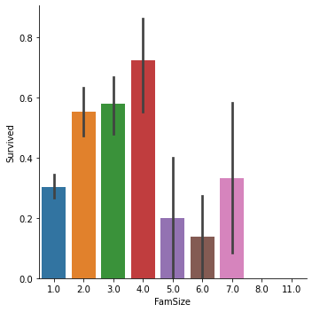
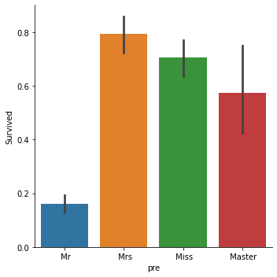
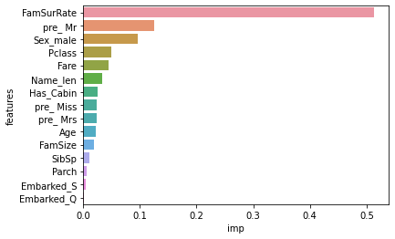

<!--
*** Thanks for checking out this README Template. If you have a suggestion that would
*** make this better, please fork the repo and create a pull request or simply open
*** an issue with the tag "enhancement".
*** Thanks again! Now go create something AMAZING! :D
-->


<!-- PROJECT SHIELDS -->
<!--
*** I'm using markdown "reference style" links for readability.
*** Reference links are enclosed in brackets [ ] instead of parentheses ( ).
*** See the bottom of this document for the declaration of the reference variables
*** for contributors-url, forks-url, etc. This is an optional, concise syntax you may use.
*** https://www.markdownguide.org/basic-syntax/#reference-style-links
-->
[![Gmail][Gmail-shield]][Gmail-url]
[![LinkedIn][linkedin-shield]][linkedin-url]


<!-- PROJECT LOGO -->
<br />
<p align="left">
  <h3 align="left">Titanic ML Problem</h3>
</p>

![][product-screenshot]


<!-- TABLE OF CONTENTS -->
## Table of Contents

* [About the Compitition](#about-the-compitition)
  * [Built With](#built-with)
* [Getting Started](#getting-started)
  * [Prerequisites](#prerequisites)
  * [Installation](#installation)
* [Usage](#usage)
* [Roadmap](#roadmap)
* [Contributing](#contributing)
* [License](#license)
* [Contact](#contact)
* [Acknowledgements](#acknowledgements)


<!-- ABOUT THE PROJECT -->
## About The Compitition


Well, we all know about legendary movie **Titanic**,that romatic story is unfortunately fictional, but the disaster was really happened.
On April 15, 1912, during her maiden voyage, the widely considered “unsinkable” RMS Titanic sank after colliding with an iceberg. Unfortunately, there weren’t enough lifeboats for everyone onboard, resulting in the death of 1502 out of 2224 passengers and crew.
While there was some element of luck involved in surviving, it seems some groups of people were more likely to survive than others.
Kaggle provides us train and test data sets, which containts details like **Sex,Age,Passenger Class,Embarked etc**,.Our job is to find who survived in test data set.

## OverView
There is many **missing values**, some hidden imoportant features like name **Prefix,Family Size**,which plays good role predicting person's survive chance,
we imputed missing values with **Random Forest Regressor** which is way more accurate than filling with **Mean,Median or most frequent value(Mode)**.
Then we used different models and tune them and pick the best model.
```sh
df.isna().sum()
```
```sh
PassengerId      0
Survived       418
Pclass           0
Sex              0
Age            263
SibSp            0
Parch            0
Ticket           0
Fare             1
Embarked         2
```
###  Brief Overview
**Filling Fare with median value cause there is too many outliers to affect our mean**
<div>
    <a href="https://plotly.com/~Aditya1112/1/?share_key=XvEsaVIjQk5BfDfei4pvWg" target="_blank" title="box" style="display: block; text-align: center;"></a>
</div>

**Family Size,Name Prefix and Their Survive Chance**

   

**Family Size with 2,3 and 4 had higher chance of Survive,
Similarly,prefix Mr[Married Man :(  ] had very low chance of Survive**

**Tuning Diffrent model and predict the future with best model**
KNN model's accuracy over K values
<div>
    <a href="https://plotly.com/~Aditya1112/3/?share_key=ELO7dxrEVylMHSaYk1tPKp" target="_blank" title="knn_lie" style="display: block; text-align: center;"></a>
</div>

After fitting some other models **Random Forest** gave the best results
```sh
confusion_matrix(y_test,y_pred_rfc)
```
Output:
```sh
array([[268,   5],
       [  2, 171]])
```
**Feature Importance**:

Prefix Mr,Sex_male and Passenger Class Highly correlate to Wheather pearson survive or not.


### Libraries used in Jupyter Notebook
* Pandas
* Numpy
* Seaborn,Matplotlib
* Plotly
* Dataprep
* Sklearn
* xgboost


<!-- GETTING STARTED -->

### Prerequisites

* Juputer Notebook
```sh
pip install notebook
```
* Titanic Data Set
[Kaggle](https://www.kaggle.com/c/titanic)
* Necessary Libraries(#Libraries used in Jupyter Notebook)
* And also a computer ;)


## Contributing
Much Much thanks to Kaggle to having amazing compititions


<!-- MARKDOWN LINKS & IMAGES -->
<!-- https://www.markdownguide.org/basic-syntax/#reference-style-links -->
[contributors-shield]: https://img.shields.io/github/contributors/othneildrew/Best-README-Template.svg?style=flat-square
[contributors-url]: https://github.com/othneildrew/Best-README-Template/graphs/contributors
[forks-shield]: https://img.shields.io/github/forks/othneildrew/Best-README-Template.svg?style=flat-square
[forks-url]: https://github.com/othneildrew/Best-README-Template/network/members
[stars-shield]: https://img.shields.io/github/stars/othneildrew/Best-README-Template.svg?style=flat-square
[stars-url]: https://github.com/othneildrew/Best-README-Template/stargazers
[issues-shield]: https://img.shields.io/github/issues/othneildrew/Best-README-Template.svg?style=flat-square
[issues-url]: https://github.com/othneildrew/Best-README-Template/issues
[license-shield]: https://img.shields.io/github/license/othneildrew/Best-README-Template.svg?style=flat-square
[license-url]: https://github.com/othneildrew/Best-README-Template/blob/master/LICENSE.txt
[linkedin-shield]: https://img.shields.io/badge/-LinkedIn-black.svg?style=flat-square&logo=linkedin&colorB=555
[linkedin-url]: https://www.linkedin.com/in/aditya-rajgor
[product-screenshot]: https://miro.medium.com/max/2000/0*TVXbu3DbzLtnfGRk.jpg
[Gmail-Shield]:https://img.shields.io/badge/Email-red.svg?logo=data:image/webp;base64,UklGRmoFAABXRUJQVlA4TF0FAAAv/8A/EJAYSZIiSa6/2AdDWXCPEyEJ///zbT7BP7WC4f/PjFSnNT3O3q22bRx5nVX36OPsLTvVtm23cZ42+X/lQJKkSJLnkcR3/5lL1jKsn9d/b8SwopTTmKNlReuEldYcjXKxztxGLl8vHq0WvF6F5HfgVDKiBcOkCncVRgkDWjKMSkgu4W0QLRpDfC4QRI9WDb2gU7LY0LJhk332jBaOrEMC2TbGJvDovdGjlUPP+xsSg2jpGCT5SglaO4q/tk3GvTHgPqlCi0clAJAzbY6RDEAhWj0KAPQm6KSEkYLTnqAHcJnLGWy5ORHXbWYuh8CKRpk4VjgPeY5RJqKUo1S0cJoFR00oFeU0we3u8iRcDDZnGnMoF/uezMFj+yjHLF10uSkjmAGBkuhqTl/A7iv3CXDzKXxxPArHNN/++JjsPt6Fdie4/0UmeK+IOyPyHI8GiP8UfZH7h2aIZf5dUVtEU4RZUk8SRrnAQB27fkhUo8qZcIpjtaNpYsvNdiN7njhS0IlcR2ikaG4zxTlqnOvqbJfajOzyGW6Ke2SvwZWZo01xAsXj3SLMF27FR7aPaL6Y4jvByO4+xYXUJYhuyhv3eUm0ycj2PXRpbskpTu5v6JLBPMLQP/SW+NfDz0LmUkVFBHkA7trOTHGJ1YhnymwhdwEqAJw2FIladv1HtlYcFAEYb0NTHNd8ZOO9wUAZAEJoUSI23Swzsm1krlARDFAJUBnJTHH5jUe2YVehGOCosesU5xD6ejVwgnIApLO0nOIuGMj8pycVoCKgttBwinuYGdkW+EFRQOp7aop3G9m+8YCyIFVCfeaWG9mpqgmFxUqoKT4ZvE3GqmZluRJKLyQzslNVszzAeNtjihN5ho98dd5ioLhoCaWheHpkx6pmddkSaon6Sa5ZyFRNKmgDOGrItCEJzxHHlKqaDcRLqFqSh0a2KpQIizSAXoDaPEpEB+6Rka0tUzWpoYcCJdSGmw+MbOupqtlEhRLqSN5dchxFqqZiAuiiRgnVxPHWyNYQq5pdAU5r5u5uLhYb2dpw0BhgvInUQ3ueXB/ZqarZSZkSyqaU4NLIVhT5Z4xOMEArhUqoT9zOcfUhVTWbqVRCTfE+w8tEqmqOAEA6c2aK50c2i3SAdmqVULwXB1OcyFN8qGo2VK2E+vdtipP7k6qaHZUroZaocyObVTEhDAPAXVupKS6OKVU1B1DkEkk1mZGtlRK6KllCU1VzKACCaTugEwIwF6AyUp8RKuisXAlNVc3WqpXQVNXsrVgJDVXNEQGpb2VvAkkK7VUqoamqOSYAd2zVY8s9gEkBTms12ihhBE+X0GpVcwaPl9BaVXNiQGW4UNUcGnBUX4NGTjA2AGnMNarmIDIltEDVHB6Q+hqvmrNoV0JZlRDCMHIlNFk1dwA4rbGqOY9WJRTvHQYWASCINlE1J9KohBqhgpn0KaGaOMFQ8iX0yao5lSYl1CI1zKVHCfWdFBYDBIpYn6iakylSQu9Xze0ATuvNqjmc8iX0o2pOp3gJpRMKsCVw1fAVRqlgQKVLqCZOsCoAqcwnVVMGwIjqllCL/GFhQOrrYdWcUsES+r1qjqlmCbXtPsDeAKtVOyWsDjAYWB7A67/Xf6//fgdi3R4r3fZozW3PLM32/FO+Pe9Fb08UDr87PBb07k4PgIL1z11Izrj9uRtB5eZUAADgGBY/dycWPqN48XOXbn/uVgOY7c9dy2v/c/ceRebC8LLgODLZ1n1bFpxFwLbnrhYI5+FlYNUPxPvaQwApYlizbSu+fP4BrIoV32BSiYUbIZOvZ7tz1+tRQAZ347TItc7db9Y/5aIpYf28/nshBgA=
[Gmail-url]: https://mail.google.com/mail/u/1/#drafts?compose=CllgCJlKGNbfJVvjLtXzkhpsgDbnCgcQtLVRtskFLsxFRcdQvxNGhbSjqLBlqdmJxrHKscPrwQV
