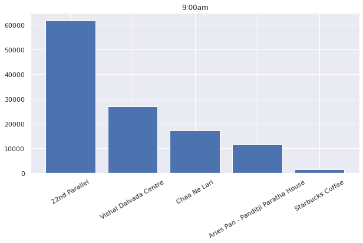

[![Gmail][Gmail-shield]][Gmail-url]
[![LinkedIn][linkedin-shield]][linkedin-url]


## About The Project
----------------------------------------**ZOMATO ZOMATO ZOMATO**----------------------------------------

I bet you definetly ordered online food from ZOMATO at least for once. Me and my hostel roommates, We used to order online when we were in Hostel. Hate to tell but this is corona time(Stay Home Stay between Data). Anyways, one day I was looking for an awesome data science project to work with and then in youtube I was getting zomato ads. I know probabily all the Indians are seeing(facing) zomato's ad on youtube. That's what spark the idea of making this project.

This Project includes **Some-Business type Questions** like **In Particular area of Vadodara which cousine is most popular?** all the way to **At 7:00am in the morning If I am in Alkapuri Area which top 5 restaurents are open?**


## Table of Contents

* [About the Project](#about-the-project)
* [Brief Overview](#brief-overview)
  * [Web Scrapping n' Cleaning](#web-scrapping-n-cleaning)
  * [Data Analysis by Vizualization](#data-analysis-by-vizualization)
  * [Questions](#questions)
* [Dependencies](#dependencies)
  * [Libraries](#libraries)
  * [Used Notebook and Softwares](#used-notebook-and-softwares)


## Brief-Overview
Welcome to ZOMATO's Start-to-End Project! 
     This Project is devided into 3 parts Web Scrapping, Data Cleaning and Data Analysis by vizualization. All three parts have separte jupyter notebooks. All the tiny details are mentioned in the their respective notebooks, So make sure to check those out. And also I've uploaded csv files, incase someone wants to dig further.

## Web Scrapping n' Cleaning
  I've done webscrapping for the first time and to be honest it was frustrating. If someone is using BeautifulSoup for the first time I bet he/she will stuck between **find** and **find_all**. After some try and error it's fine. 
**NOTE:All the rights of the data set is reserved by zomato and I've used their information for fair use**
[Zomato bot permission page](https://www.zomato.com/robots.txt)


 
One of the probelem I faced was to pass Null Value when Restaurent Has Either Rating(and Counts) or Delivery Rating(and Counts).
 
**The restaurents I wanted**


          
**The restaurents I get**

 

Delivery rating and Rating are only differ from the color of Their Star. 

All the restaurents have **opening time and closing time**. So other challange was to change this opening hours into **pandas date-time series**. This problem's solution was as easy as it looks complicated.

```
In [998]:

df['1st_time_open']='2020-10-15'+' '+df['1st_time_open_hour']+':'+df['1st_time_open_minute']+df['1st_time_open_ampm']
df['1st_time_close']='2020-10-15'+' '+df['1st_time_close_hour']+':'+df['1st_time_close_minute']+df['1st_time_close_ampm']

df['2nd_time_open']='2020-10-15'+' '+df['2nd_time_open_hour']+':'+df['2nd_time_open_minute']+df['2nd_time_open_ampm']
df['2nd_time_close']='2020-10-15'+' '+df['2nd_time_close_hour']+':'+df['2nd_time_close_minute']+df['2nd_time_close_ampm']

In [999]:

df['1st_time_open']=pd.to_datetime(df['1st_time_open'])
df['1st_time_close']=pd.to_datetime(df['1st_time_close'])

df['2nd_time_open']=pd.to_datetime(df['2nd_time_open'])
df['2nd_time_close']=pd.to_datetime(df['2nd_time_close'])
```
I used **dummy date, month and year** to change these columns into **date-time**. Now we can consider **Hours** only. BOOM! 

## Data Analysis by Vizualizations
**Let's put life on this dataset**


**Sayajigunj is the area where my hostel and college located. Therefore Most of the customers are students in that area, who order lunch and dinner. Because As a students, we prefer Classic Gujarati dish above all.**


**Both rating counts graphs are intresting, for me Rating counts follows left sided skewed normal distribution whereas, Delivery rating counts follows exponential distribution. We can find the probability of any given point with distribution's parameters**


**This plot shows all the restaurents popularity in the Red line and each Bar shows Price(for two person's) By different cousines. From this we can see that Gujarati Restaurents are not only popular but comes with reasonable price**

 

**This plot shows that when time is 7:00 am there is only one restaurent open in Alkapuri(Chaa ni Lari) and when time is 8:00 am there is lots of restaurents being opened but we are seeing the result of top 5 restaurents. Pretty cool right!**


## Questions
1. Which Cousine Restaurent has most counts in all restaurents?
2. Which cousine type restaurent is rare?
3. Which Cousine's restaurents has most counts (in pair) from all restaurents?
4. Which Area has most number of zomato restaurents?
5. Which area is famous for which cousine type?
6. Which cousine is most popular in Whole vadodara?
7. which cousine type restaurents is cheap for 2 persons?
8. Which cousine type you recommend someone to order who's not fimiliar to vadodara's best?
9. Which cousine type restaurent is cheaper or costly in Alkapuri Area? And which restaurent to choose if you are in Alkapuri Area?
10. In specific area at specific time which restaurent is best and what are the other options?

**Check the Notebook for these anwers, Reload 2 or 3 times if it's not open**


There is tons of intresting plots to put. But lemme just put one **useless chart**, which I made to find relationship between **opening time** and **Area**.It somewhat looks like **Robot**. This project was quite long, I enjoyed it alot. Next time maybe I'll compare **Zomato** with **Swiggy**.


# Dependencies
## Libraries
* Pandas
* Matplotlib
* Seaborn
* Plotly
* Requests
* BeautifulSoup

## Used Notebook and Softwares
* Jupyter Notebook
* PyCharm
* Chrome browser


**Until Next Time, Order on ZOMATO**


<!-- MARKDOWN LINKS & IMAGES -->
<!-- https://www.markdownguide.org/basic-syntax/#reference-style-links -->
[kaggle-shield]: 
[kaggle-url]: https://www.kaggle.com/adityarajgor
[license-url]: https://github.com/othneildrew/Best-README-Template/blob/master/LICENSE.txt
[linkedin-shield]: https://img.shields.io/badge/-LinkedIn-black.svg?style=flat-square&logo=linkedin&colorB=555
[linkedin-url]: https://www.linkedin.com/in/aditya-rajgor
[product-screenshot]: https://miro.medium.com/max/2000/0*TVXbu3DbzLtnfGRk.jpg
[Gmail-Shield]:https://img.shields.io/badge/Email-red.svg?logo=data:image/webp;base64,UklGRmoFAABXRUJQVlA4TF0FAAAv/8A/EJAYSZIiSa6/2AdDWXCPEyEJ///zbT7BP7WC4f/PjFSnNT3O3q22bRx5nVX36OPsLTvVtm23cZ42+X/lQJKkSJLnkcR3/5lL1jKsn9d/b8SwopTTmKNlReuEldYcjXKxztxGLl8vHq0WvF6F5HfgVDKiBcOkCncVRgkDWjKMSkgu4W0QLRpDfC4QRI9WDb2gU7LY0LJhk332jBaOrEMC2TbGJvDovdGjlUPP+xsSg2jpGCT5SglaO4q/tk3GvTHgPqlCi0clAJAzbY6RDEAhWj0KAPQm6KSEkYLTnqAHcJnLGWy5ORHXbWYuh8CKRpk4VjgPeY5RJqKUo1S0cJoFR00oFeU0we3u8iRcDDZnGnMoF/uezMFj+yjHLF10uSkjmAGBkuhqTl/A7iv3CXDzKXxxPArHNN/++JjsPt6Fdie4/0UmeK+IOyPyHI8GiP8UfZH7h2aIZf5dUVtEU4RZUk8SRrnAQB27fkhUo8qZcIpjtaNpYsvNdiN7njhS0IlcR2ikaG4zxTlqnOvqbJfajOzyGW6Ke2SvwZWZo01xAsXj3SLMF27FR7aPaL6Y4jvByO4+xYXUJYhuyhv3eUm0ycj2PXRpbskpTu5v6JLBPMLQP/SW+NfDz0LmUkVFBHkA7trOTHGJ1YhnymwhdwEqAJw2FIladv1HtlYcFAEYb0NTHNd8ZOO9wUAZAEJoUSI23Swzsm1krlARDFAJUBnJTHH5jUe2YVehGOCosesU5xD6ejVwgnIApLO0nOIuGMj8pycVoCKgttBwinuYGdkW+EFRQOp7aop3G9m+8YCyIFVCfeaWG9mpqgmFxUqoKT4ZvE3GqmZluRJKLyQzslNVszzAeNtjihN5ho98dd5ioLhoCaWheHpkx6pmddkSaon6Sa5ZyFRNKmgDOGrItCEJzxHHlKqaDcRLqFqSh0a2KpQIizSAXoDaPEpEB+6Rka0tUzWpoYcCJdSGmw+MbOupqtlEhRLqSN5dchxFqqZiAuiiRgnVxPHWyNYQq5pdAU5r5u5uLhYb2dpw0BhgvInUQ3ueXB/ZqarZSZkSyqaU4NLIVhT5Z4xOMEArhUqoT9zOcfUhVTWbqVRCTfE+w8tEqmqOAEA6c2aK50c2i3SAdmqVULwXB1OcyFN8qGo2VK2E+vdtipP7k6qaHZUroZaocyObVTEhDAPAXVupKS6OKVU1B1DkEkk1mZGtlRK6KllCU1VzKACCaTugEwIwF6AyUp8RKuisXAlNVc3WqpXQVNXsrVgJDVXNEQGpb2VvAkkK7VUqoamqOSYAd2zVY8s9gEkBTms12ihhBE+X0GpVcwaPl9BaVXNiQGW4UNUcGnBUX4NGTjA2AGnMNarmIDIltEDVHB6Q+hqvmrNoV0JZlRDCMHIlNFk1dwA4rbGqOY9WJRTvHQYWASCINlE1J9KohBqhgpn0KaGaOMFQ8iX0yao5lSYl1CI1zKVHCfWdFBYDBIpYn6iakylSQu9Xze0ATuvNqjmc8iX0o2pOp3gJpRMKsCVw1fAVRqlgQKVLqCZOsCoAqcwnVVMGwIjqllCL/GFhQOrrYdWcUsES+r1qjqlmCbXtPsDeAKtVOyWsDjAYWB7A67/Xf6//fgdi3R4r3fZozW3PLM32/FO+Pe9Fb08UDr87PBb07k4PgIL1z11Izrj9uRtB5eZUAADgGBY/dycWPqN48XOXbn/uVgOY7c9dy2v/c/ceRebC8LLgODLZ1n1bFpxFwLbnrhYI5+FlYNUPxPvaQwApYlizbSu+fP4BrIoV32BSiYUbIZOvZ7tz1+tRQAZ347TItc7db9Y/5aIpYf28/nshBgA=
[Gmail-url]: https://mail.google.com/mail/u/1/#drafts?compose=CllgCJlKGNbfJVvjLtXzkhpsgDbnCgcQtLVRtskFLsxFRcdQvxNGhbSjqLBlqdmJxrHKscPrwQV
